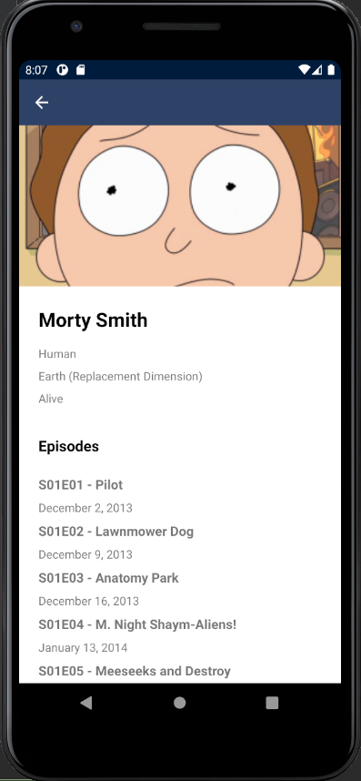

# Rick and Morty Android App

A Rick and Morty Android app using the REST api (https://rickandmortyapi.com/documentation/) to get a list of characters and which episodes they are in.

## Data Used
- Get all characters (https://rickandmortyapi.com/api/character)
- Get character by id (https://rickandmortyapi.com/api/character/{id})
- Get multiple episodes (https://rickandmortyapi.com/api/episode/{episodes})

## Screenshot

